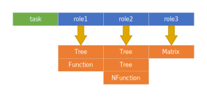

# Transport API definition

## Parameters

Parameters are the primitives of BAT polyglot transport API. The idea is that client-server transport should support 
only a limited number of primitives and construct any mathematical model from these primitives.

Any server should support following primitive types:

### Tree
A tree of values which could return a numeric, boolean o string value by string key. Keys are represented by paths where
tokens are separated by `.` like `key1.key2.key3`. 

### Vector
A numeric vector of fixed size with optional list of names.

### Matix
A numeric matrix with optional name lists for both dimensions.

### Function
A `(Double)->Double` function reference.

### NFunction
A `(Vector)->Double` function reference with fixed input vector size and optional list of names for input vector.

### Mapping
A `(Vector)->Vector` function reference with fixed input and output sizes with optional name lists for input and output. 
 

**Functions are not supported via remote.**

## Server API

Transport-level server could run one ore several **tasks** taking a set of parameters as an input and returning a set of 
parameters as output. All parameters are supplied with role (string). Several parameters could share the same role if
it is supported by server. Usual behavior is when different objects with the same role describe the same object using 
different means. For example, function could be passed as reference or as DSL description. 



Basic server call looks like this:
```c
Parameters call(String task, Parameters parameters);
```

Additionally, server must implement two utility functions:
```c
Tree check(String task, Parameters parameters);
```
to check if passed parameters are valid without actually starting computation, and
```c
StringList tasks();
```
to return the list of supported tasks.

### Entity references
**TODO**